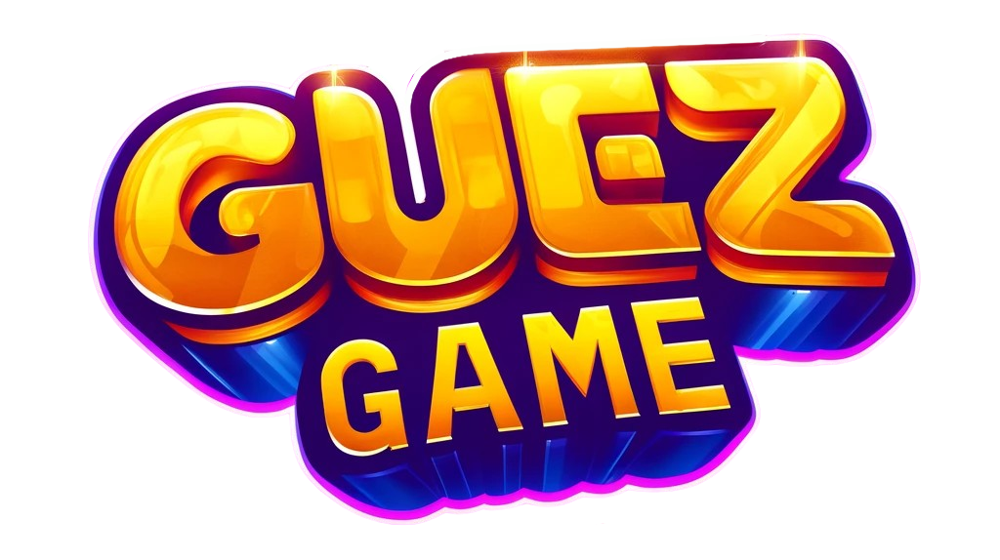

# GuezGame

Welcome to the GuezGame repository, our multiplayer mini-games web app.

This is the final project of our third year at Epitech, completed in two months by a team of five developers.

The technologies used are Spring Boot for the back-end and React for the front-end, with the use of Websockets for real-time communication.
